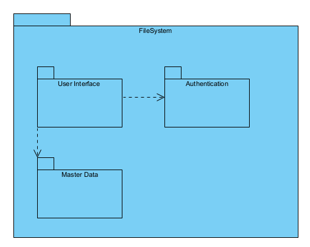

## Implementation View - Level 2

------------------------------
This view is the transition from the logical view of the system to the implementation view, which aims to show the packages, interfaces and classes of the system, thus giving a clearer view of how the system is implemented.

--------------------------------

