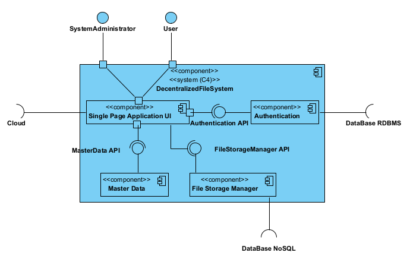

## Logic View - Level 2

------------------------------
The logical view (component diagram) is intended to give an overview of the structure and organization of the system architecture. This is level 2, which is a less abstract view of what we saw in level 1. On the next level up, level 3, we'll look in detail at the components of all the system's modules.
--------------------------------
