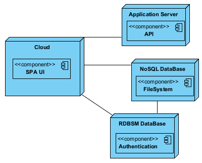

## Physical View - Level 2

------------------------------
This view is about mapping the various components of the software onto the hardware, i.e. where the software runs.

--------------------------------
